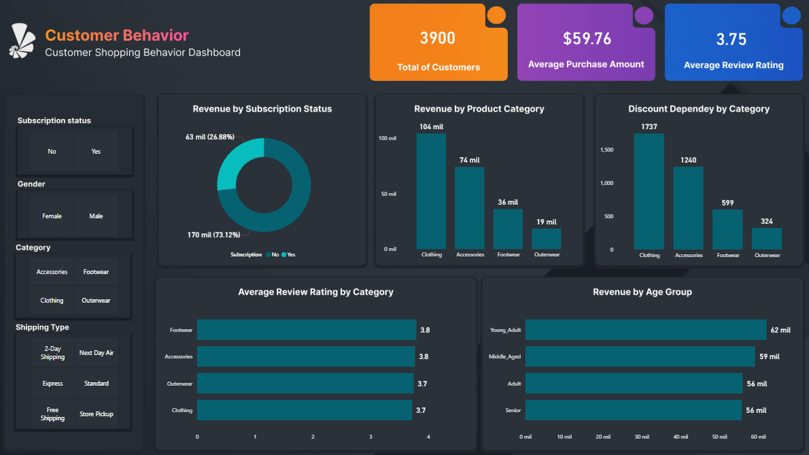

# 📊 Retail Customer Behavior Analysis — Python, SQL & Power BI


---

This project delivers a complete end-to-end analysis of customer shopping behavior using Python, SQL, and Power BI. It explores the factors influencing purchase decisions, revenue contribution, discount sensitivity, product performance, and customer loyalty.

The final output includes a fully interactive Poswer BI dashboard and a business-oriented executive summary with actionable recommendations.

---

## 🎯 1. Project Objective

The goal of this analysis is to understand **who buys, what they buy, how they buy, and what drives repeat purchases**, enabling strategic decisions in:

- Marketing & segmentation
- Pricing & discount strategy
- Product & inventory management
- Subscription and loyalty optimization
- Logistics and shipping preferences

Key business questions addressed:

- Which segments drive the highest revenue?
- How do discounts impact profitability?
- Which products/categories have the strongest review performance?
- Do subscription users behave differently?
- How does shipping preference relate to average order value?
- How do loyalty levels differ (New, Returning, Loyal)?

---

## 📊 2. Dashboard Preview (Power BI)

> _Fully interactive Power BI report included in the repository._



---

## 🛠️ 3. Tools & Technologies

### Python stack

- `pandas` — data cleaning & transformation
- `numpy` — numeric operations
- `matplotlib` / `seaborn` / `plotly` — visual analytics
- `jupyter` — exploratory notebook

### SQL

- PostgreSQL for tabular analysis
- `sqlalchemy` for programmatic loading

### Power BI

- Final executive dashboard for stakeholders

---

## 📁 4. Repository Structure

```
├── customer_behavior_analysis.ipynb    # Python EDA + charts
├── customer_behavior_data.csv          # Main dataset
├── customer_behavior_sql_queries.sql   # SQL analysis
├── customer_behavior_dashbord.pbix     # Power BI report (note: filename in repo)
├── customer_behavior_executive_summary.pdf/.docx
├── requirements.txt
└── README.md
```

---

## 📈 5. Key Insights (Summary)

### 1. Revenue Concentration by Demographics

Young Adults and Middle-Aged customers generate the highest revenue contribution.

### 2. Discount Dependency in Key Categories

Products such as **Hats, Sandals, Sneakers, Coats** show high discount-linked purchasing behavior, suggesting margin risk.

### 3. High-Value Discount Users

Some customers consistently spend above average _even when using discounts_ — a segment ideal for premium bundles or upsells.

### 4. Product Ratings Reveal Satisfaction Drivers

High-rated categories (Footwear, Accessories) don't always correlate with highest sales — opportunity for targeted promotion.

### 5. Shipping Preference & Order Value

Express shipping correlates with slightly higher purchase amounts, signaling a segment willing to spend for convenience.

### 6. Subscription Paradox

Most revenue comes from **non-subscribers**, despite similar average spend. The subscription offering may lack compelling value.

---

## ⚙️ 6. Running the Project

### Environment Setup

```pwsh
python -m venv .venv
& '.\.venv\Scripts\Activate.ps1'
& '.\.venv\Scripts\python.exe' -m pip install -r requirements.txt
```

### Running the notebook

```pwsh
jupyter notebook
```

### Optional: Load data into PostgreSQL

Update credentials in the notebook cell using `sqlalchemy` before running.

---

## 📚 7. Business Conclusions

The analysis highlights opportunities to:

- Strengthen profitability by reducing discount-dependency in specific categories.
- Improve retention by redefining subscription benefits.
- Target high-value customer segments more effectively.
- Promote high-rated products that currently lack visibility.
- Optimize logistics strategy around Express-inclined customers.

The dataset supports evidence-based decisions for marketing, loyalty, and product strategy.

---

## ✨ 8. Author

Project developed by **Enrique**.
For questions, improvements, or collaborations, feel free to open an Issue or PR.
